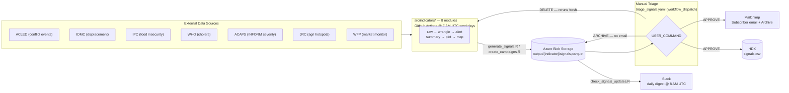
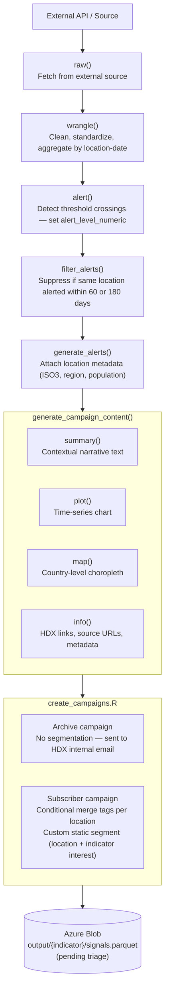
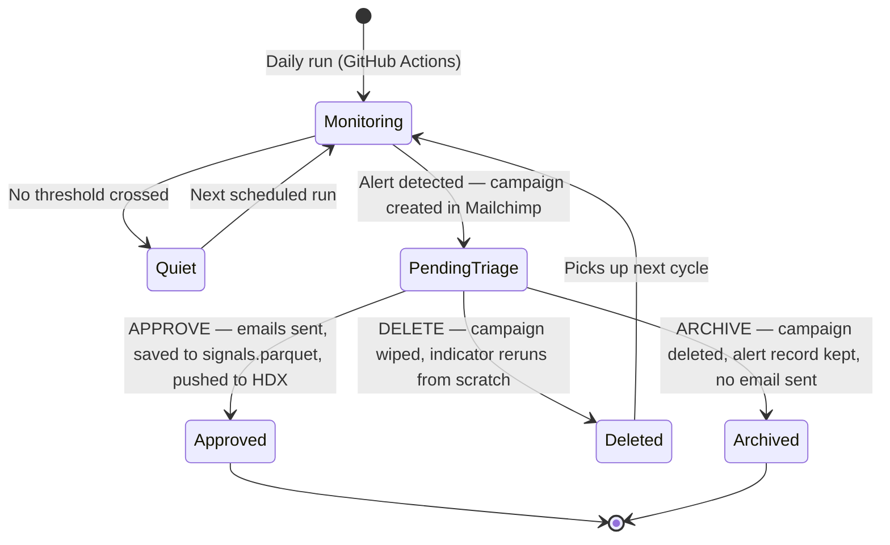
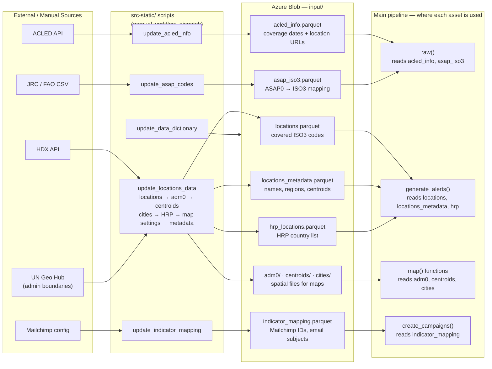

# HDX Signals — Architecture

Four diagrams covering the system from different angles.

---

## 1. System Overview

High-level flow from data sources through signal generation to final outputs.

---

## 2. Indicator Module Pipeline

How a single indicator module processes raw data into a Mailchimp campaign. Every indicator follows this same structure — the file names are `{step}_{indicator}.R` inside `src/indicators/{indicator}/utils/`.

---

## 3. Signal Lifecycle

State transitions from alert detection through human triage to final disposition. Signals sit in pending state until a human runs the triage workflow.

---

## 4. GitHub Actions Schedule

When each workflow runs and what triggers it.

```mermaid
flowchart TD
    subgraph daily["Scheduled — Weekdays Mon–Fri UTC"]
        subgraph t7["7:00 AM — Monitor workflows (run in parallel)"]
            M1["monitor_acled_conflict"]
            M2["monitor_idmc_displacement_conflict"]
            M3["monitor_idmc_displacement_disaster"]
            M4["monitor_ipc_food_insecurity"]
            M5["monitor_who_cholera"]
            M6["monitor_acaps_inform_severity"]
            M7["monitor_jrc_agricultural_hotspots"]
            M8["monitor_wfp_market_monitor"]
        end

        subgraph t8["8:00 AM — Slack digest"]
            SLACK["post_slack_update<br/>check_signals_updates.R"]
        end
    end

    subgraph weekly["Scheduled — Mondays @ 8:00 AM UTC"]
        BACKUP["backup_mailchimp<br/>Snapshot audience to Azure"]
        ANALYTICS["user_audience_analysis<br/>Create user + campaign analytics datasets"]
    end

    subgraph manual["Manual — workflow_dispatch only"]
        TRIAGE["triage_signals<br/>Inputs: USER_COMMAND · INDICATOR_ID · confirm flag"]
        STATIC["Static asset updates<br/>update_locations_data · update_indicator_mapping<br/>update_data_dictionary · update_acled_info · update_asap_codes"]
    end

    subgraph automated["Automated — on pull request to main"]
        CHECK["check_changes — validates CHANGES.md is updated"]
        LINT["lint — R linting (lintr)"]
        TEST["test_signals — unit tests for email components + utils"]
        PROMPTS["publish_prompts — rebuilds docs/PROMPTS.md if prompt .txt files changed"]
    end

    t7 --> t8
```

> **Note on dry-run defaults:** All monitor workflows default to `HS_DRY_RUN: TRUE` and `HS_LOCAL: TRUE`. Production writes only happen when these are explicitly set to `FALSE` in the workflow dispatch inputs. The triage workflow similarly gates on `HS_DRY_RUN` before dispatching emails or writing to HDX.

---

## 5. Static Assets

Static assets are reference data stored in Azure Blob `input/`. They are updated infrequently via manual `workflow_dispatch` and consumed by the main signal pipeline at runtime.

